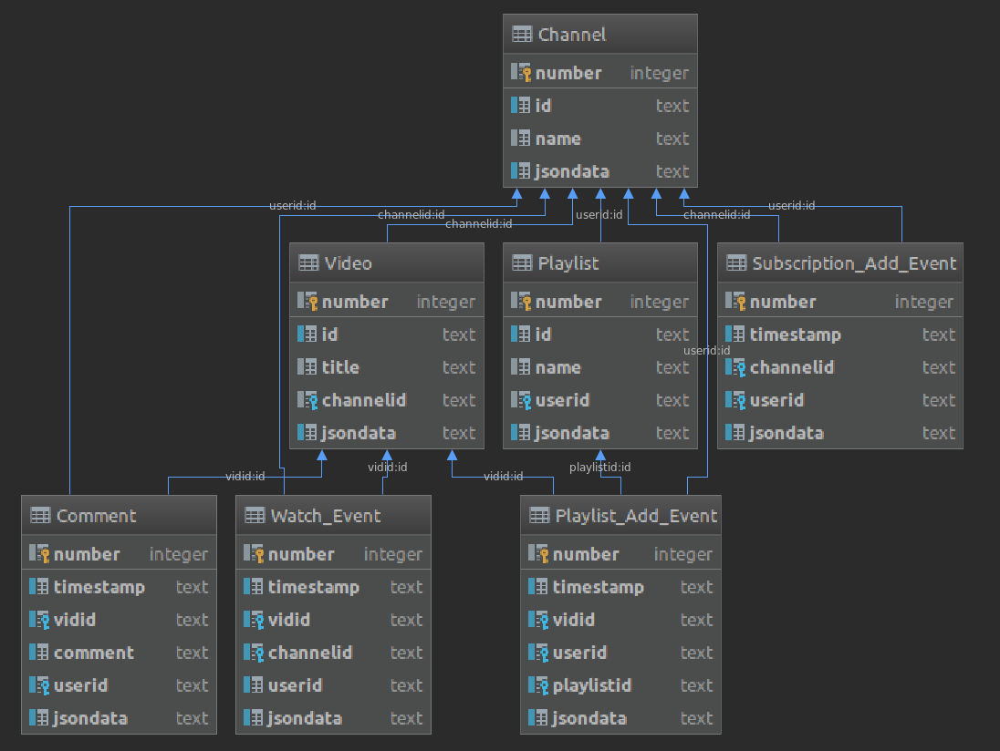

# Tube2SQL
This is a tool for analyzing relationships between YouTube channels in terms of videos, playlists, subscriptions and comments made by and in between channels. This can be used to visualize activity relationships between users or channels, perform Social Network Analysis of selected targets, or cross-reference activity habits between users and/or channels. The data used to create the database comes from Google in JSON format, and can be obtained either through a request from takeout.google.com (with the options detailed below) or via the use of the YouTube Data API which is built into this tool. All that is required is a YouTube account or a (free) Google Developer account.

## Installation
This tool was developed on Ubuntu Linux, and while the path conventions used *should* be compatible with Windows pathnames, this has not yet been tested. To install the software, git clone the project to a local directory, then from the command line in the root directory, run `$ pip install -r requirements.txt` which should install all required package dependencies. 

## Before running for the first time
This tool relies on external sources of data to build up it's relational database, which must be acquired from takeout.google.com or pulled from YouTube's Data API using an appropriate developer account client secrets file (and an active internet connection). You should get one or both of these sources set up before you try to use the tool, or see the "Test Takeout and unit tests" section below for information on running the tool on provided dummy JSON files.

### Google Takeout
This tool needs the following files from Google YouTube Takeout to create it's database without any additional information: **history, my-comments, playlists, and subscriptions**.

In a web browser, go to takeout.google.com, and scroll down to "Create a New Archive". Click on the "Deselect All" link, then scroll down to near the bottom of the page and check the box next to "YouTube". Click the button titled "All YouTube data included" and deselect everything except for **history, my-comments, playlists, and subscriptions**. It is important that you get all four of these, because certain information necessary to build the relational database is included in some of these files but not the others. Click OK to close the popup. Next, click on the "Multiple formats" button in the YouTube section, and **select "JSON" for the watch-history entry (all others should be greyed out)**. Now, click on the "Next Step" button on the bottom right of the page. This will take you to the final page, which will as you to verify how you would like the archive delivered (defaults should be fine, you will be emailed a link to download a .zip file with the files). Once you receive this file (it may take a few minutes to an hour for the archive to be emailed to you), **extract the complete folder structure including the "Takeout" folder into the `../tube2sql/inputfiles/` directory**. If you don't do this, you will need to manually specify the path to the `Takeout` directory by argument.

### YouTube Data API
In a web browser, go to developer.google.com, and register for an account. Create a new project and name it whatever you would like. From the APIs and Services dashboard, click on the "Credentials" option in the left hand navigation pane. Click on the "Create credentials" dropdown button, and choose "OAuth client ID". Select "Web Application" and click the "Create" button. Once all the forms have been filled out, navigate back to the Credentials page, and under "OAuth 2.0 client IDs", your new credentials should appear. All the way on the right hand side, click on the pen icon to download your credentials file (client secrets JSON file). Place it in the root directory of the tool so it can be found automatically.

## Using the tool to relate Takeout data
If the Takeout files have been placed in the `inputfiles` directory, just running the command `tube2sql takeout` should process all of the files there and save the results in a SQLite database file in the `../tube2sql/db/` directory, with a filename composed of the username which is the owner of the Takeout account and a timestamp.

## Options
Global option: 
* `-db --database <path>` - Specifies the path to an existing SQLite db to append to, otherwise default behavior is to create a new db file for every run.
## Takeout Subcommand 
* `tube2sql takeout [options]` = This will attempt to parse the takeout JSON files. If no options are specified, files will be looked for in `../tube2sql/inputfiles/  `, and a new output db will be created in `../tube2sql/db`. 
## Takeout Subcommand options
* `-d --directory <path>` Specifies location of Takeout files
* `-u --userid <string>` Specifies userid to use when creating db 
* `-un --username <string>` Specifies username to use when creating db 
## JSON Subcommand
* `tube2sql takeout [options]` This will attempt to query the YouTube Data API for the items specified in the options (at least one must be specified)
##JSON Subcommand options
* `-chid --channelid` Query by channel ID, add it to the Channel table
* `--chn --channelname` Query by channel name (custom YouTube URL) and add it to the Channel table
* `--plid --playlistid` Query by playlist ID, add it to the Playlist table
* `--plit --playlistiditems` Query by playlist ID, and add all videos contained to the Video table, all channels contained to the Channel table, and each item to the Playlist_Add_Event table, making additional sub-queries to fill in missing information.
* `-vid --videoid` Query by video ID *not yet implemented*
* `-s --secrets <path>` Specify path to client secrets file for accessing YouTube API
* `-m --maxqueries <int>` Specify max number of calls to make to the API *not yet implemented*

## Database Structure
This image shows the relational structure of the tables in the SQLite db created by the tool:

## Test Takeout files and unit tests
Some unit tests have been written using the pytest framework, which are located in the `/test` directory. Also provided in the test directory are a set of Takeout files in an appropriate directory structure, which can be used to test the functionality of the program without having to download user information from Google Takeout. 

To run the tool on the test files, use the command `tube2sql takeout -d "../test/Takeout Test Files/"`

## Author
Tim Roach

## License

This project is licensed under the MIT License - see the [LICENSE.md](LICENSE.md) file for details
